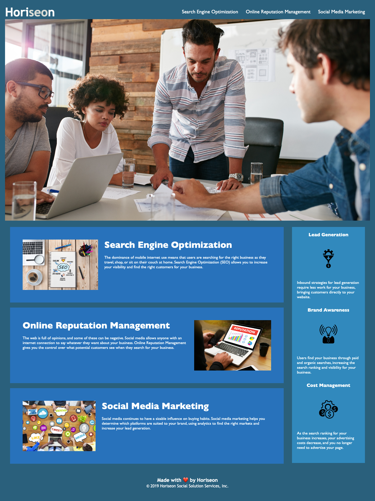

# Horiseon Website Accessibility Update 💻

## Description 📄

This project involved updating an existing website to enhance its accessibility and semantic structure. We've made numerous updates to the HTML and CSS codebase for the Horiseon website to ensure it meets accessibility standards and is optimized for search engines.

## Updates Made 🛠️

### HTML:

🧱 Replaced non-semantic div elements with semantic HTML elements (header, nav, main, section, article, aside, footer) for clarity of structure, improved readability, and better accessibility.

📸 Added meaningful alt attributes to images to improve accessibility for visually impaired users or in cases where the image fails to load.

📑 Updated the title of the webpage to make it more descriptive and relevant to the site's content.

🔗 Fixed the linked issue by adding id and class for the search-engine-optimizatuon selector.

### CSS:

🎨 The CSS for this project has been updated with the goal of enhancing the site's accessibility and search engine optimization (SEO). This has been accomplished by introducing semantic elements in the HTML and refactoring the CSS to be more maintainable and efficient.

#### Detailed CSS Changes 📝

**CSS Variables:** Introduced CSS variables to the codebase, allowing for consistent styling and easy changes in the future. These variables, defined in the :root selector, include color schemes and font families used throughout the website.

**CSS Selectors:** Utilized various types of CSS selectors for efficient styling. This includes element selectors (e.g., body, p, h1), class selectors (e.g., .header, .footer), the universal selector (*), and pseudo-class selectors (e.g., :root).

**Box Model:** Set the box-sizing property to border-box for all elements. This includes the padding and border in an element's total width and height, leading to a more predictable layout.

**Cascade Order:** Respected the cascade order in CSS to ensure the styles are applied as intended. Specificity and source order have been taken into account, with more specific selectors overriding more general ones.
Future Improvements 💡

While the current updates have greatly improved the CSS efficiency and website accessibility, there are always opportunities for further enhancements:

**Media Queries:** Incorporating media queries could improve the website's responsiveness on different screen sizes and devices.

**CSS Comments:** More detailed comments can be added to complex CSS rules to improve readability and maintainability.

**CSS Formatting:** Consistent formatting and organization of CSS rules could further enhance the readability of the codebase.

By continuing to focus on accessibility and maintainability, the website's usability and SEO can be continuously improved, leading to a better user experience and potentially higher search engine rankings.

### Accessibility Standards 🎯

The updates made to this website are in accordance with the Web Content Accessibility Guidelines (WCAG) as set out by the World Wide Web Consortium (W3C).

### License 📃

This project is licensed under the terms of the MIT license.

### Repository and GitHub Pages 📌

You can access the code for this project in the [repository on GitHub.](https://github.com/MrSep01/site-refactoring-accessibilty) 

The website is hosted using GitHub Pages and can be accessed [here.](https://mrsep01.github.io/site-refactoring-accessibilty/)

### Screenshot 🖼️

